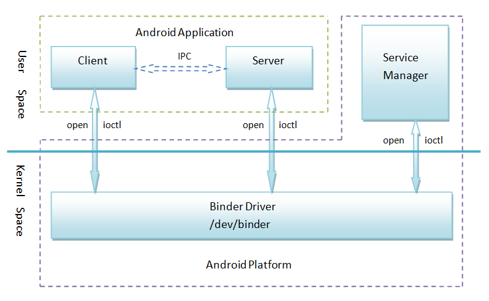

# Interview-Questions

## Android Components: 
There are some necessary building blocks that an Android application consists of. These loosely coupled components are bound by the application manifest file which contains the description of each component and how they interact. The manifest file also contains the app’s metadata, its hardware configuration, and platform requirements, external libraries, and required permissions. There are the following main components of an android app:

	1. Activities
Activities are said to be the presentation layer of our applications. The UI of our application is built around one or more extensions of the Activity class. By using Fragments and Views, activities set the layout and display the output and also respond to the user’s actions. An activity is implemented as a subclass of class Activity. 
	2. Services
Services are like invisible workers of our app. These components run at the backend, updating your data sources and Activities, triggering Notification, and also broadcast Intents. They also perform some tasks when applications are not active. A service can be used as a subclass of class Service. 

	3. Content Providers
It is used to manage and persist the application data also typically interacts with the SQL database. They are also responsible for sharing the data beyond the application boundaries. The Content Providers of a particular application can be configured to allow access from other applications, and the Content Providers exposed by other applications can also be configured. A content provider should be a sub-class of the class ContentProvider.
  
	4. Broadcast Receivers
They are known to be intent listeners as they enable your application to listen to the Intents that satisfy the matching criteria specified by us. Broadcast Receivers make our application react to any received Intent thereby making them perfect for creating event-driven applications.

	5. Intents
It is a powerful inter-application message-passing framework. They are extensively used throughout Android. Intents can be used to start and stop Activities and Services, to broadcast messages system-wide or to an explicit Activity, Service or Broadcast Receiver or to request action be performed on a particular piece of data.

<b>Android IPC:</b>
IPC is the abbreviation of Inter-Process Communication, which means inter-process communication and cross-process communication , and refers to the process of direct data exchange between two processes .
The Binder mechanism is a unique inter-process communication mechanism adopted by Android . A driver based on the OpenBinder framework, used to provide inter-process communication on the Android platform.
The underlying implementations of Messenger , ContentProvider , and AIDL are all Binder .

Interview Questions:
What are the methods of Android IPC? Advantages and disadvantages and applicable scenarios?

	Bundle : Attach data to the Bundle and transmit it via Intent
	File sharing : Two processes exchange data by reading and writing a file
	AIDL : Android Interface Definition Language
	Messenger : message-based inter-process communication
	ContentProvider :: dedicated to data sharing between different applications
	Socket : Use TCP and UDP protocol for network communication. 
	Note: RPC——Remote Procedure Call
	
## Binder's system architecture:
<b>Service Manager:</b> Service Manager is mainly responsible for all the services in the Android system. When the client wants to communicate with the server, it will first query and obtain the services that need to be interacted through the Service Manager. Of course, each service also needs to register its own service with Service Manager so that it can be queried and obtained by the server.
<b>Service (Service):</b> The service here is the server mentioned above, which is usually also an Android system service. You can query and obtain a Server through the Service Manager.
<b>Client:</b> The client here generally refers to the application service on the Android system. It can request services in Service, such as Activity.
Service proxy The service proxy refers to the Server proxy (proxy) generated in the client application. From the application point of view, there is no difference between a service proxy and a local object. Both methods can be called. The methods are synchronized and return corresponding results. Service agent is also the core module of Binder mechanism.

<b>Binder driver</b> is used to implement the device driver of Binder, which is mainly responsible for organizing Binder's service nodes, calling Binder-related processing threads, and completing the actual Binder transmission. It is located at the bottom of the Binder structure (ie, the Linux kernel layer).

The structural relationship between them is as follows:

<li>Client, Server and Service Manager are implemented in user space, and Binder driver is implemented in kernel space</li>
<li>Binder driver and Service Manager have been implemented in the Android platform, developers only need to implement their own Client and Server in the user space</li>
<li>The Binder driver provides the device file/dev/binder to interact with the user space. Client, Server and Service Manager communicate with the Binder driver through open and ioctl file operation functions</li>
<li>The inter-process communication between Client and Server is implemented indirectly through the Binder driver</li>
<li>Service Manager is a daemon process used to manage Server and provide Client with the ability to query Server interface</li>

## AIDL workflow
Answer: The essence of AIDL file is a tool provided by the system to quickly realize Binder, so the workflow of AIDL can be explained by Binder. 

## How to use AIDL
<li><b>Server</b> The server must first create a remote Service to listen to the client's connection request, then create an AIDL file, declare the interface exposed to the client in this AIDL file, and finally implement the AIDL interface in the Service.</li>

<li><b>The client</b> first binds the Service of the server. After the binding is successful, the Binder object returned by the server is converted into the type of the AIDL interface, and then the methods in the AIDL can be called.</li>

<li><b>AIDL file supported data types</b>
		Basic data type;
		String and CharSequence;
		List: Only supports ArrayList, each element in it must be supported by AIDL;
		Map: Only supports HashMap, each element in it must be supported by AIDL, including key and value;
		Parcelable: all objects that implement the Parcelable interface;
		AIDL: All AIDL interfaces themselves can be used in AIDL files.</li>

<li>Parcelable and AIDL objects must be explicitly imported regardless of whether they are in the same package as the current AIDL file.</li>

<li>The server implementation needs to pay attention to concurrent processing, you can use the Copy-On-Write container</li>

<li>When the server implements monitoring, the monitoring storage container uses RemoteCallbackList, and the system specifically provides an interface to delete cross-process listeners</li>

<li>The AIDL package structure must be consistent between the server and the client, otherwise errors will occur, because the client must deserialize all classes related to the AIDL interface in the server. If the complete path of the class is different, the deserialization cannot be successful .</li>

<li>After AIDL calls the server method, it will hang up and wait. If the server performs a large number of time-consuming operations, it will cause the client ANR. Solution: The client call can be placed in a non-UI thread.</li>

